# Modelo Entidade-Relacionamento — Tech Hub

Modelo de dados completo do marketplace (Django + PostgreSQL), gerado a partir de
`marketplace_app/models.py`.

- O diagrama **Mermaid** abaixo renderiza direto no GitHub, no VS Code (extensão
  *Markdown Preview Mermaid*) e em [mermaid.live](https://mermaid.live).
- Para um diagrama visual editável, cole o bloco **DBML** (final do arquivo) em
  [dbdiagram.io](https://dbdiagram.io).

---

## Diagrama (Mermaid)

```mermaid
erDiagram
    %% ===================== IDENTIDADE =====================
    USER ||--o| COMMON_PROFILE : "perfil PF"
    USER ||--o| STORE_PROFILE  : "perfil PJ"
    USER ||--o| CART           : "possui"

    %% ===================== CATÁLOGO =======================
    USER     ||--o{ LISTING        : "anuncia (seller)"
    CATEGORY ||--o{ LISTING        : "classifica"
    LISTING  ||--o{ LISTING_IMAGE  : "tem imagens"
    LISTING  ||--o{ COMMENT        : "recebe"
    USER     ||--o{ COMMENT        : "escreve"
    COMMENT  ||--o{ COMMENT        : "responde (parent)"

    %% ===================== CARRINHO =======================
    CART    ||--o{ CART_ITEM : "contém"
    LISTING ||--o{ CART_ITEM : "referencia"

    %% ===================== PEDIDO / COMPRA ================
    USER    ||--o{ ORDER       : "compra (buyer)"
    ORDER   ||--o{ ORDER_ITEM  : "contém"
    LISTING ||--o{ ORDER_ITEM  : "referencia"
    USER    ||--o{ ORDER_ITEM  : "vende (seller)"
    ORDER   ||--o| PAYMENT_TRANSACTION : "pagamento"
    ORDER   ||--o| DELIVERY    : "entrega"

    %% ===================== MENSAGENS (anúncio) ============
    USER    ||--o{ MESSAGE : "envia (sender)"
    USER    ||--o{ MESSAGE : "recebe (receiver)"
    LISTING ||--o{ MESSAGE : "sobre"

    %% ===================== NEGOCIAÇÃO DE TROCA ============
    USER    ||--o{ TRADE_REQUEST : "solicita (requester)"
    USER    ||--o{ TRADE_REQUEST : "responde (counterparty)"
    LISTING ||--o{ TRADE_REQUEST : "alvo da troca"

    TRADE_REQUEST ||--o{ TRADE_PROPOSAL : "propostas"
    USER          ||--o{ TRADE_PROPOSAL : "propõe (proposer)"
    TRADE_PROPOSAL ||--o{ TRADE_PROPOSAL_IMAGE : "imagens"

    TRADE_REQUEST  ||--o| TRADE_FULFILLMENT : "execução"
    TRADE_PROPOSAL ||--o{ TRADE_FULFILLMENT : "acordo (agreed_proposal)"

    TRADE_REQUEST ||--o{ TRADE_MESSAGE  : "mensagens"
    USER          ||--o{ TRADE_MESSAGE  : "envia (sender)"

    TRADE_REQUEST ||--o{ TRADE_DELIVERY : "entregas (1 por lado)"
    USER          ||--o{ TRADE_DELIVERY : "informa"

    %% ===================== ENTIDADES ======================
    USER {
        int      id PK
        string   username UK
        string   email
        string   password
        string   first_name
        string   last_name
        bool     is_store
        image    profile_picture
        bool     is_staff
        bool     is_active
        datetime date_joined
    }

    COMMON_PROFILE {
        int    id PK
        int    user_id FK "OneToOne -> USER"
        string cpf UK "validado (dígito verificador)"
        date   birth_date "18+"
        string phone
        string cep
        string address
    }

    STORE_PROFILE {
        int    id PK
        int    user_id FK "OneToOne -> USER"
        string cnpj UK "validado"
        string razao_social
        string fantasy_name
        string state_registration
        string responsible_name
        string responsible_cpf
        string phone
        string email
        string commercial_cep
        string commercial_address
        bool   verified "Loja Verificada"
    }

    CATEGORY {
        int    id PK
        string name
        string slug UK
    }

    LISTING {
        int      id PK
        int      seller_id FK "-> USER"
        int      category_id FK "-> CATEGORY"
        string   title
        text     description
        text     trade_suggestions
        decimal  price "null em troca"
        string   listing_type "sale | trade | both"
        string   condition "new | used"
        string   status "active | paused | sold"
        bool     is_featured
        bool     is_store_featured
        datetime created_at
    }

    LISTING_IMAGE {
        int   id PK
        int   listing_id FK "-> LISTING"
        image image
    }

    COMMENT {
        int      id PK
        int      listing_id FK "-> LISTING"
        int      user_id FK "-> USER"
        int      parent_id FK "-> COMMENT (auto)"
        text     content
        datetime created_at
    }

    CART {
        int      id PK
        int      user_id FK "OneToOne -> USER"
        datetime created_at
    }

    CART_ITEM {
        int      id PK
        int      cart_id FK "-> CART"
        int      listing_id FK "-> LISTING"
        string   desired_action "buy | trade"
        datetime added_at
    }

    ORDER {
        int      id PK
        int      buyer_id FK "-> USER"
        string   payment_method "pix | credit | debit | transfer"
        string   delivery_method
        string   status "pending | paid | cancelled | completed"
        decimal  total_amount
        text     notes
        datetime created_at
        datetime updated_at
    }

    ORDER_ITEM {
        int     id PK
        int     order_id FK "-> ORDER"
        int     listing_id FK "-> LISTING"
        int     seller_id FK "-> USER"
        string  title_snapshot
        decimal unit_price_snapshot
        int     quantity
    }

    PAYMENT_TRANSACTION {
        int      id PK
        int      order_id FK "OneToOne -> ORDER"
        string   gateway "mercado_pago"
        string   status "pending..approved..refunded"
        string   external_reference
        string   preference_id
        url      checkout_url
        decimal  amount
        json     payload
        datetime created_at
        datetime updated_at
    }

    DELIVERY {
        int      id PK
        int      order_id FK "OneToOne -> ORDER"
        string   method
        string   recipient_name
        string   recipient_phone
        string   postal_code
        string   street
        string   number
        string   complement
        string   neighborhood
        string   city
        string   state
        decimal  shipping_cost
        string   carrier_name
        string   tracking_code
        string   status "pending..delivered"
        date     estimated_delivery_date
        datetime delivered_at
        text     notes
        datetime created_at
        datetime updated_at
    }

    MESSAGE {
        int      id PK
        int      sender_id FK "-> USER"
        int      receiver_id FK "-> USER"
        int      listing_id FK "-> LISTING"
        text     content
        datetime created_at
    }

    TRADE_REQUEST {
        int      id PK
        int      requester_id FK "-> USER"
        int      counterparty_id FK "-> USER (dono do anúncio)"
        int      listing_id FK "-> LISTING"
        string   status "pending..completed..cancelled"
        text     initial_message
        datetime created_at
        datetime updated_at
    }

    TRADE_PROPOSAL {
        int      id PK
        int      trade_request_id FK "-> TRADE_REQUEST"
        int      proposer_id FK "-> USER"
        text     item_description
        decimal  cash_amount "diferença em R$"
        text     note
        datetime created_at
    }

    TRADE_PROPOSAL_IMAGE {
        int   id PK
        int   proposal_id FK "-> TRADE_PROPOSAL"
        image image
    }

    TRADE_FULFILLMENT {
        int      id PK
        int      trade_request_id FK "OneToOne -> TRADE_REQUEST"
        int      agreed_proposal_id FK "-> TRADE_PROPOSAL (SET_NULL)"
        decimal  payment_amount
        string   payment_method
        string   payment_status "draft..completed"
        string   payment_checkout_token
        json     payment_payload
        datetime payment_confirmed_at
        string   delivery_method
        string   recipient_name
        string   postal_code
        string   street
        string   city
        string   state
        datetime confirmed_at
        datetime created_at
        datetime updated_at
    }

    TRADE_MESSAGE {
        int      id PK
        int      trade_request_id FK "-> TRADE_REQUEST"
        int      sender_id FK "-> USER"
        text     content
        datetime created_at
    }

    TRADE_DELIVERY {
        int      id PK
        int      trade_request_id FK "-> TRADE_REQUEST"
        int      user_id FK "-> USER"
        string   delivery_method
        string   recipient_name
        string   postal_code
        string   street
        string   city
        string   state
        text     notes
        string   status "draft | sent | delivered | cancelled"
        datetime created_at
        datetime updated_at
    }
```



---

## Resumo dos relacionamentos

| De | Para | Cardinalidade | Observação |
|----|------|---------------|------------|
| User | CommonProfile | 1 : 0..1 | OneToOne (PF) |
| User | StoreProfile | 1 : 0..1 | OneToOne (PJ) |
| User | Cart | 1 : 0..1 | OneToOne |
| User | Listing | 1 : N | `seller` |
| Category | Listing | 1 : N | |
| Listing | ListingImage | 1 : N | múltiplas imagens |
| Listing | Comment | 1 : N | |
| User | Comment | 1 : N | autor |
| Comment | Comment | 1 : N | auto-relacionamento (`parent` → respostas) |
| Cart | CartItem | 1 : N | único por (cart, listing) |
| Listing | CartItem | 1 : N | |
| User | Order | 1 : N | `buyer` |
| Order | OrderItem | 1 : N | |
| Listing | OrderItem | 1 : N | guarda *snapshot* de título/preço |
| User | OrderItem | 1 : N | `seller` |
| Order | PaymentTransaction | 1 : 0..1 | OneToOne (Mercado Pago) |
| Order | Delivery | 1 : 0..1 | OneToOne |
| User | Message | 1 : N | `sender` e `receiver` (2 relações) |
| Listing | Message | 1 : N | chat por anúncio |
| User | TradeRequest | 1 : N | `requester` e `counterparty` (2 relações) |
| Listing | TradeRequest | 1 : N | |
| TradeRequest | TradeProposal | 1 : N | propostas/contrapropostas |
| User | TradeProposal | 1 : N | `proposer` |
| TradeProposal | TradeProposalImage | 1 : N | |
| TradeRequest | TradeFulfillment | 1 : 0..1 | OneToOne (execução do acordo) |
| TradeProposal | TradeFulfillment | 1 : N | `agreed_proposal` (SET_NULL) |
| TradeRequest | TradeMessage | 1 : N | |
| TradeRequest | TradeDelivery | 1 : N | uma por participante |

---

## Versão DBML (para dbdiagram.io)

> Cole em [dbdiagram.io](https://dbdiagram.io) para gerar o diagrama visual e exportar PNG/PDF.

```dbml
Table user {
  id int [pk]
  username varchar [unique]
  email varchar
  first_name varchar
  last_name varchar
  is_store boolean
  profile_picture varchar
}

Table common_profile {
  id int [pk]
  user_id int [ref: - user.id]
  cpf varchar [unique]
  birth_date date
  phone varchar
  cep varchar
  address varchar
}

Table store_profile {
  id int [pk]
  user_id int [ref: - user.id]
  cnpj varchar [unique]
  razao_social varchar
  fantasy_name varchar
  state_registration varchar
  responsible_name varchar
  responsible_cpf varchar
  phone varchar
  email varchar
  commercial_cep varchar
  commercial_address varchar
  verified boolean
}

Table category {
  id int [pk]
  name varchar
  slug varchar [unique]
}

Table listing {
  id int [pk]
  seller_id int [ref: > user.id]
  category_id int [ref: > category.id]
  title varchar
  description text
  trade_suggestions text
  price decimal
  listing_type varchar
  condition varchar
  status varchar
  is_featured boolean
  is_store_featured boolean
  created_at datetime
}

Table listing_image {
  id int [pk]
  listing_id int [ref: > listing.id]
  image varchar
}

Table comment {
  id int [pk]
  listing_id int [ref: > listing.id]
  user_id int [ref: > user.id]
  parent_id int [ref: > comment.id]
  content text
  created_at datetime
}

Table cart {
  id int [pk]
  user_id int [ref: - user.id]
  created_at datetime
}

Table cart_item {
  id int [pk]
  cart_id int [ref: > cart.id]
  listing_id int [ref: > listing.id]
  desired_action varchar
  added_at datetime
  indexes {
    (cart_id, listing_id) [unique]
  }
}

Table order {
  id int [pk]
  buyer_id int [ref: > user.id]
  payment_method varchar
  delivery_method varchar
  status varchar
  total_amount decimal
  notes text
  created_at datetime
  updated_at datetime
}

Table order_item {
  id int [pk]
  order_id int [ref: > order.id]
  listing_id int [ref: > listing.id]
  seller_id int [ref: > user.id]
  title_snapshot varchar
  unit_price_snapshot decimal
  quantity int
}

Table payment_transaction {
  id int [pk]
  order_id int [ref: - order.id]
  gateway varchar
  status varchar
  external_reference varchar
  preference_id varchar
  checkout_url varchar
  amount decimal
  payload json
  created_at datetime
  updated_at datetime
}

Table delivery {
  id int [pk]
  order_id int [ref: - order.id]
  method varchar
  recipient_name varchar
  recipient_phone varchar
  postal_code varchar
  street varchar
  number varchar
  complement varchar
  neighborhood varchar
  city varchar
  state varchar
  shipping_cost decimal
  carrier_name varchar
  tracking_code varchar
  status varchar
  estimated_delivery_date date
  delivered_at datetime
  notes text
  created_at datetime
  updated_at datetime
}

Table message {
  id int [pk]
  sender_id int [ref: > user.id]
  receiver_id int [ref: > user.id]
  listing_id int [ref: > listing.id]
  content text
  created_at datetime
}

Table trade_request {
  id int [pk]
  requester_id int [ref: > user.id]
  counterparty_id int [ref: > user.id]
  listing_id int [ref: > listing.id]
  status varchar
  initial_message text
  created_at datetime
  updated_at datetime
}

Table trade_proposal {
  id int [pk]
  trade_request_id int [ref: > trade_request.id]
  proposer_id int [ref: > user.id]
  item_description text
  cash_amount decimal
  note text
  created_at datetime
}

Table trade_proposal_image {
  id int [pk]
  proposal_id int [ref: > trade_proposal.id]
  image varchar
}

Table trade_fulfillment {
  id int [pk]
  trade_request_id int [ref: - trade_request.id]
  agreed_proposal_id int [ref: > trade_proposal.id]
  payment_amount decimal
  payment_method varchar
  payment_status varchar
  payment_checkout_token varchar
  payment_payload json
  payment_confirmed_at datetime
  delivery_method varchar
  recipient_name varchar
  postal_code varchar
  street varchar
  city varchar
  state varchar
  confirmed_at datetime
  created_at datetime
  updated_at datetime
}

Table trade_message {
  id int [pk]
  trade_request_id int [ref: > trade_request.id]
  sender_id int [ref: > user.id]
  content text
  created_at datetime
}

Table trade_delivery {
  id int [pk]
  trade_request_id int [ref: > trade_request.id]
  user_id int [ref: > user.id]
  delivery_method varchar
  recipient_name varchar
  postal_code varchar
  street varchar
  city varchar
  state varchar
  notes text
  status varchar
  created_at datetime
  updated_at datetime
}
```
